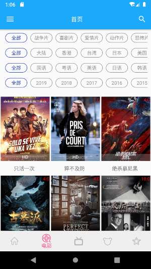
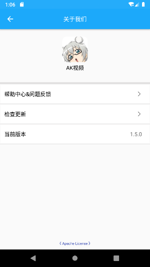
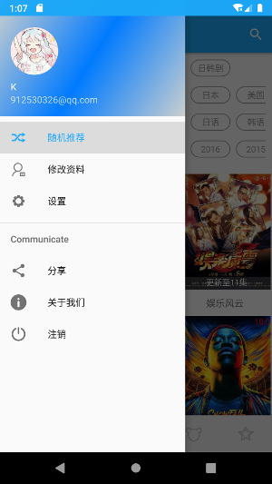
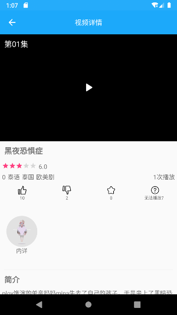

### 视频APP

#### V1.6.0
1. 优化搜索功能。
2. 添加了最热搜索关键词。
3. 添加了搜索记录显示及清除。
4. 添加了启动检查版本更新功能。
5. 添加了退出需要两下按键功能。
6. 修复了无法使用年份进行筛选视频的问题。
7. 修复了个人资料里不显示头像的问题。

#### V1.5.0
更新了很多东西
1. 新增了登录功能。
2. 新增了点赞和不喜欢的功能。（该功能可以一直刷，只要你喜欢）
3. 新增了没有播放源的反馈功能。
4. 新增了个人信息的修改功能。（同步壁纸APP）
5. 新增了清除缓存功能。
6. 新增了关于我们的功能。
7. 新增了随机推荐功能。
8. 优化了封面图不能自适应。
9. 优化了界面以及搜索。

#### V1.0.0
1. 支持各模块观看功能。
2. 支持首页推荐功能。
3. 支持播放详情页剧集选择。
4. 支持主演和名称搜索。

#### PS：好多功能还没写完，现在只是可以看可以搜索，最近不太想写了。2019.7.16
#### PS：写的差不多了。2019.7.31
